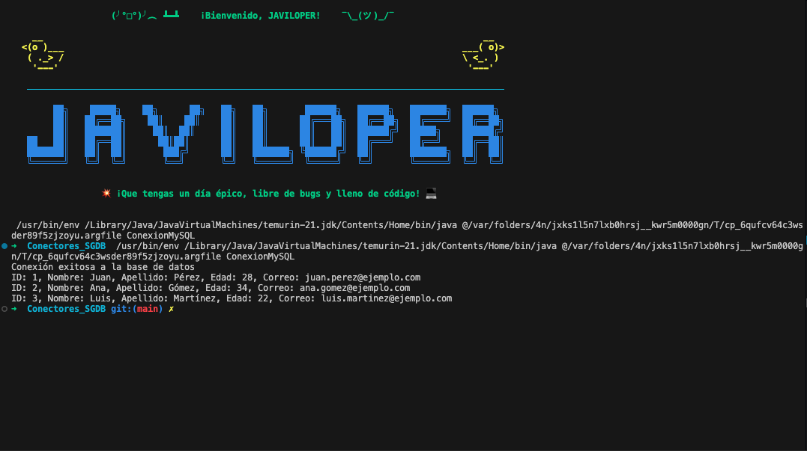

# Java MySQL JDBC

Escribe un programa en Java que realice las siguientes acciones:
1. Conéctate a una base de datos MySQL utilizando JDBC.
2. Consulta todos los registros de una tabla llamada `usuarios`.
3. Muestra por consola los resultados obtenidos.

## Creación de la Tabla

Antes de ejecutar el programa, asegúrate de tener creada la tabla `usuarios` en tu base de datos MySQL. Aquí tienes el código SQL para crearla:

```sql
CREATE TABLE usuarios (
    id INT PRIMARY KEY AUTO_INCREMENT,
    nombre VARCHAR(50) NOT NULL,
    apellido VARCHAR(50) NOT NULL,
    edad INT,
    correo VARCHAR(100) UNIQUE NOT NULL
);

# Resultado esperado:
